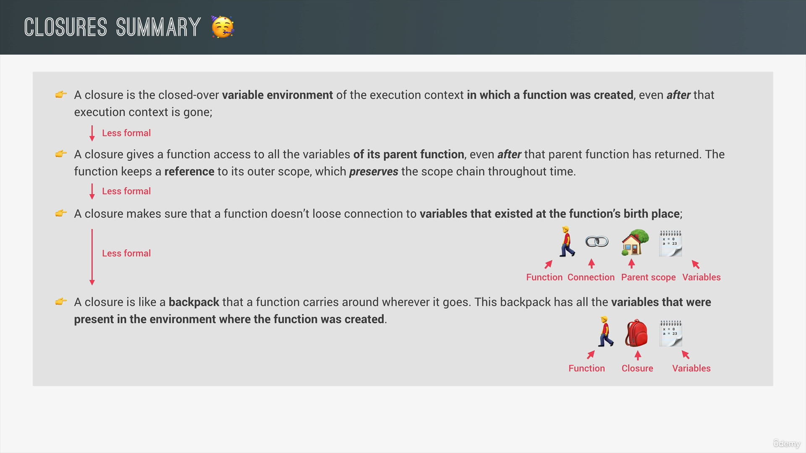

# [advanced] IIFE & Closure

## IIFE（立即執行函式）

> IFE (Immediately Invoked Function Expression) 是一個定義完馬上就執行的 JavaScript function。 - [MDN](https://developer.mozilla.org/zh-TW/docs/Glossary/IIFE)

當我們希望能夠立即執行函式，且只執行一次，就可以使用此設計模式。

```javascript
// IIFE
(function() {
    console.log("立即執行！");
})();
```

```javascript
// 也可以用於箭頭函式
(() => console.log("這個也會立即執行！"))();
```

在這種表達式中，函式定義與函式調用的括號是一起的，確保函式只會被執行一次。在這個封閉的作用域中，變數和函式都不會污染全局環境。

IIFE 其實不是 JavaScript 語言的特性，而是由其他程式設計師構想出來的一個模式，接著越傳越遠，慢慢被許多人開始使用。

---

## Closure（閉包）

要了解 JavaScript 中這個重要的概念，可以直接從以下的程式碼範例開始看：

```javascript
function outer() {
  let count = 0;
  return function inner() {
    count ++;
    console.log(count);
  }
}

const inner = outer();

inner(); // 1
inner(); // 2
inner(); // 3
```

在上面的例子中，當我們創造函式 `outer()` 時，該函式就已經存取、訪問過執行環境中的 Variable Environment（VE）了。

> 🔗 有關於 JavaScript 執行環境的筆記可以看[這裡]()。

**Closure**（**閉包**）則是指 VE 會依附在 `outer` 函式上，讓我們在一個內層函式中（這邊的 `inner`），訪問到外部函式的作用域（這邊的 `outer`），並且會記住外部函式的變數，也就是變數 `a`。

{data-zoomable}

### 使用範例

- [ ] TODO: 範例補充

---

Reference：

> [JavaScript 立即調用函式 IIFE (Immediately Invoked Function Expression) 是什麼？優缺點是什麼？- ExplainThis.io](https://www.explainthis.io/zh-hant/swe/what-is-iife)
> [重新認識 JavaScript: Day 19 閉包 Closure](https://ithelp.ithome.com.tw/articles/10193009)
> [[JS] 深入淺出 JavaScript 閉包（closure）](https://pjchender.dev/javascript/js-closure/)
